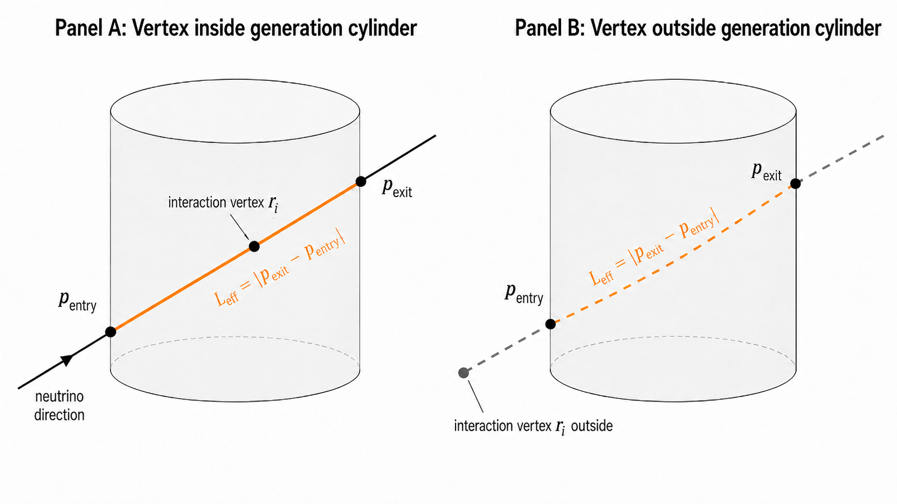

# LeptonInjector Weight Formula for Volume Mode

This note documents what `calculate_LIW.py` currently does when producing the
`oneweight` column. For now, this document focuses only on the raw
LeptonWeighter `get_oneweight(event)` calculation for volume mode.

## Source Files

The relevant script in this repository is:

```text
DataPreperation/EventWeights/LIW/calculate_LIW.py
```

The LeptonWeighter object is built from two ingredients:

```python
generators = LW.MakeGeneratorsFromLICFile(lic_path)
weighter = LW.Weighter(_xs, generators)
```

where:

```text
lic_path  = matched LeptonInjector .lic file for the current batch
_xs       = cross-section object loaded from CSMS differential spline files
generators = generator configuration read from the .lic file
```

The cross-section object is loaded as:

```python
_xs = LW.CrossSectionFromSpline(
    XS_PATH + "dsdxdy_nu_CC_iso.fits",
    XS_PATH + "dsdxdy_nubar_CC_iso.fits",
    XS_PATH + "dsdxdy_nu_NC_iso.fits",
    XS_PATH + "dsdxdy_nubar_NC_iso.fits",
)
```

## Per-Frame Inputs

For each readable DAQ frame, the script requires:

```text
I3EventHeader
EventProperties
```

The event identity is taken from `I3EventHeader`:

```text
RunID       = hdr.run_id
SubrunID    = hdr.sub_run_id
EventID     = hdr.event_id
SubEventID  = hdr.sub_event_id
```

The physics quantities are taken from `EventProperties` and copied into a
`LeptonWeighter.Event` object:

```text
EventProperties.totalEnergy       -> event.energy
EventProperties.zenith            -> event.zenith
EventProperties.azimuth           -> event.azimuth
EventProperties.finalStateX       -> event.interaction_x
EventProperties.finalStateY       -> event.interaction_y
EventProperties.initialType       -> event.primary_type
EventProperties.finalType1        -> event.final_state_particle_0
EventProperties.finalType2        -> event.final_state_particle_1
EventProperties.impactParameter   -> event.radius
EventProperties.totalColumnDepth  -> event.total_column_depth
EventProperties.x                 -> event.x
EventProperties.y                 -> event.y
EventProperties.z                 -> event.z
```

In code, the object is built like this:

```python
event = LW.Event()
event.energy = props.totalEnergy
event.zenith = props.zenith
event.azimuth = props.azimuth
event.interaction_x = props.finalStateX
event.interaction_y = props.finalStateY
event.primary_type = primary
event.final_state_particle_0 = fs0
event.final_state_particle_1 = fs1
event.radius = props.impactParameter
event.total_column_depth = props.totalColumnDepth
event.x = props.x
event.y = props.y
event.z = props.z
```

The particle-type fields are converted from `EventProperties` particle codes to
LeptonWeighter particle enums before they are assigned:

```python
primary = to_lw_particle(props.initialType)
fs0 = to_lw_particle(props.finalType1)
fs1 = to_lw_particle(props.finalType2)
```


## Example: MC000009 Electron Neutrino

### Generation Script

Source generation script:

```text
/project/6008051/pone_simulation/MC000009-nu_e-2_6-LeptonInjector_PROPOSAL_clsim-v17.1/runscripts/GenerateEvents.py
```

### Generators in One Matched LIC File

This script has two volume-mode electron generators in each matched LIC file:

```text
G_e- : EMinus + Hadrons, Ranged = False
G_e+ : EPlus  + Hadrons, Ranged = False
```

### Electron-Neutrino Denominator Reduction

So the general denominator is:

```math
G_{\mathrm{total}}(i) = G_{e^-}(i) + G_{e^+}(i)
```

For an electron-neutrino event:

```math
G_{e^+}(i) = 0
```

Therefore:

```math
\boxed{
\mathrm{oneweight}_i(\nu_e)
=
\frac{\sigma_i}{G_{e^-}(i)}
}
```

### Numerator Substitution

Substituting the numerator for an electron-neutrino charged-current event:

```math
\boxed{
\mathrm{oneweight}_i(\nu_e)
=
\frac{
    10^4\,
    \mathrm{dsdxdy\_nu\_CC\_iso}
    \left(
        \log_{10}E_i,
        \log_{10}x_i,
        \log_{10}y_i
    \right)
}{
    G_{e^-}(i)
}
}
```

### Cross-Section Unit Conversion

The factor `10^4` comes directly from the LeptonWeighter source code:

```text
msq_tocmsq = 1.e4
```

It is a hardcoded unit-conversion factor used when returning the cross-section:

```text
sigma_i = msq_tocmsq * spline_value
```

In words:

```text
1 m^2 = 10^4 cm^2
```

### Denominator First Look

First look at the denominator:

```math
G_{e^-}(i)
=
N_{e^-}
\times
P_E
\times
P_{\mathrm{direction}}
\times
P_{\mathrm{interaction}}
\times
P_{\mathrm{position}}
```

For this electron-neutrino event, the final-state matching factor is already:

```math
P_{\mathrm{final\ state}} = 1
```

### Number of Generated Events in the Active Generator

For this electron-neutrino event-weight calculation:

```math
N_{e^-} = 100
```

not `200`.

The reason is:

```text
G_e- uses only the EMinus + Hadrons generator.
```

The file has two generators:

```text
100 events from the e- generator
100 events from the e+ generator
```

So the file has `200` generated events in total, but for an electron-neutrino
event:

```math
G_{e^+}(i) = 0
```

and therefore the denominator uses:

```math
N_{e^-} = 100
```

### Generated-Energy Probability

For this sample, the generated-energy probability is:

```math
P_E(E_i)
=
\begin{cases}
\dfrac{
    (1 - 1.5) E_i^{-1.5}
}{
    (10^6)^{1 - 1.5} - (10^2)^{1 - 1.5}
},
& 10^2 \le E_i \le 10^6 \\
0,
& \mathrm{otherwise}
\end{cases}
```

### Generated-Direction Probability

For this sample, the generated-direction probability is:

```math
P_{\mathrm{direction}}(\theta_i,\phi_i)
=
\begin{cases}
\dfrac{1}
{(\phi_{\max}-\phi_{\min})
(\cos\theta_{\min}-\cos\theta_{\max})},
& \theta_i,\phi_i \mathrm{\ inside\ bounds} \\
0,
& \mathrm{otherwise}
\end{cases}
```

For `MC000009`:

```text
theta_min = 0
theta_max = pi
phi_min = 0
phi_max = 2 pi
```

Therefore:

```math
P_{\mathrm{direction}}
=
\frac{1}
{(2\pi - 0)(\cos 0 - \cos\pi)}
=
\frac{1}{4\pi}
```

### Volume-Position Probability

For this sample, the volume-position probability is:

```math
P_{\mathrm{position}}
=
\frac{
    L_{\mathrm{eff}}(\vec{r}_i,\theta_i,\phi_i)
}{
    10^4 \pi (900)^2 (1100)
}
```

if the event vertex is inside the generation cylinder.

If the event vertex is outside the cylinder:

```math
P_{\mathrm{position}} = 0
```

Here `L_eff` is the full chord length through the generation cylinder.

For the event position and direction, imagine the straight line passing through:

```text
r_i = (event.x, event.y, event.z)
```

with direction:

```text
(event.zenith, event.azimuth)
```

This line intersects the generation cylinder at two points:

```text
p_entry = where the line enters the cylinder
p_exit  = where the line exits the cylinder
```

The interaction point is somewhere between these two points:

```text
p_entry ---- r_i ---- p_exit
```

Therefore:

```math
L_{\mathrm{eff}}
=
\left|
\vec{p}_{\mathrm{exit}}
-
\vec{p}_{\mathrm{entry}}
\right|
```

In words:

```text
L_eff is the full length of the direction line inside the generation cylinder.
```

It is not only the distance from the interaction point to the exit point.



## Appendix

### Why the Energy Probability Has This Form

The generator samples energy from a power-law probability density:

```math
P_E(E) = C E^{-\alpha}
```

Because this is a probability density, it must integrate to one over the
generation energy range:

```math
\int_{E_{\min}}^{E_{\max}} P_E(E)\,dE = 1
```

Substituting the power law:

```math
C \int_{E_{\min}}^{E_{\max}} E^{-\alpha}\,dE = 1
```

For `alpha != 1`:

```math
\int E^{-\alpha}\,dE =
\frac{E^{1-\alpha}}{1-\alpha}
```

Therefore:

```math
C
\frac{
E_{\max}^{1-\alpha} - E_{\min}^{1-\alpha}
}{
1-\alpha
}
= 1
```

Solving for `C` gives:

```math
C =
\frac{
1-\alpha
}{
E_{\max}^{1-\alpha} - E_{\min}^{1-\alpha}
}
```

So the normalized generated-energy probability density is:

```math
P_E(E) =
\frac{
(1-\alpha) E^{-\alpha}
}{
E_{\max}^{1-\alpha} - E_{\min}^{1-\alpha}
}
```

For the `MC000009` electron sample:

```text
alpha = 1.5
E_min = 10^2 GeV
E_max = 10^6 GeV
```

### Why `L_eff` Appears Even Though `P_direction` Already Exists

`P_direction` and `P_position` are not the same probability factor.

`P_direction` answers:

```text
How likely was it for the generator to choose this neutrino direction?
```

For the `MC000009` electron sample, directions are generated uniformly over the
full sky, so:

```math
P_{\mathrm{direction}} = \frac{1}{4\pi}
```

This only accounts for choosing the direction `(event.zenith, event.azimuth)`.

`P_position` answers a different question:

```text
After this direction is chosen, how much generation-cylinder path length is
available for an interaction vertex with this position-direction geometry?
```

For a fixed direction, different lines through the cylinder can have different
lengths inside the cylinder. A line passing near the center has a larger
`L_eff`; a line grazing the cylinder edge has a smaller `L_eff`.

So:

```text
P_direction chooses the direction.
L_eff describes the available chord length inside the cylinder for that
position-direction combination.
```

This is why the volume-mode position factor contains:

```math
P_{\mathrm{position}}
\propto
L_{\mathrm{eff}}(\vec{r}_i,\theta_i,\phi_i)
```

### Why the Interaction Probability Has This Form

A neutrino travelling through a column of matter encounters target nucleons
along its path. Each nucleon presents an effective area `σ_tot` to the
neutrino (the total cross section). The number of target nucleons per unit
area along the path is:

```math
N_{\mathrm{targets}} = N_A \cdot \mathrm{col\_depth}
```

In an infinitesimal slice of thickness `dx`, the probability of interacting is:

```math
dP_{\mathrm{interact}} = \sigma_{\mathrm{tot}} \cdot n \cdot dx
```

where `n` is the number density of targets. Integrating this along the full
column — the same differential equation as radioactive decay or Beer-Lambert
attenuation — gives the probability of **surviving** without interacting:

```math
P_{\mathrm{survive}} = e^{-\sigma_{\mathrm{tot}} \cdot N_A \cdot \mathrm{col\_depth}}
```

Therefore the probability of **interacting at least once** is:

```math
P_{\mathrm{interact}} = 1 - e^{-\sigma_{\mathrm{tot}} \cdot N_A \cdot \mathrm{col\_depth}}
```

LeptonInjector forces every generated event to interact. The factor
`(1 - \exp(-\sigma_{\mathrm{tot}} \cdot N_A \cdot \mathrm{col\_depth}))` inside
`P_{\mathrm{interaction}}` carries this forced-interaction correction into
`G(i)`, so that when the oneweight is computed it correctly accounts for the
natural interaction probability.

#### What `col_depth` is in volume mode

In volume mode, `totalColumnDepth` is the column depth along the full chord
through the generation cylinder — from `p_entry` to `p_exit`, where these are
the two points at which the neutrino track intersects the cylinder wall. This
is the same chord shown in Panel A of the figure below:


The column depth is computed using the Earth density model between those two
intersection points (source:
`LeptonInjector/private/LeptonInjector/LeptonInjector.cxx`, lines 794–795):

```cpp
properties->totalColumnDepth =
    earthModel->GetColumnDepthInCGS(
        std::get<0>(cylinder_intersections),
        std::get<1>(cylinder_intersections)
    );
```

**Ranged mode is different.** In ranged mode `totalColumnDepth` is the sum of
the lepton range (converted from MWE to g/cm²) and the column depth through
the injection endcaps — a more complex quantity that is not simply the cylinder
chord (source: same file, lines 652–653).

```math
P_{\mathrm{interaction}}(E_i, x_i, y_i)
=
\frac{
    \left.\dfrac{d^2\sigma}{dx\,dy}\right|_{\mathrm{LIC}}
    \!\left(\log_{10}E_i,\,\log_{10}x_i,\,\log_{10}y_i\right)
}{
    1 - \exp\!\left(
        -\sigma_{\mathrm{tot,LIC}}\!\left(\log_{10}E_i,\,\log_{10}x_i,\,\log_{10}y_i\right)
        \cdot N_A \cdot \mathrm{col\_depth}_i
    \right)
}
```

## Oneweight as Importance Sampling

The oneweight formula is an importance sampling ratio:

```math
\mathrm{oneweight} =
\frac{\text{what I want to weight with}}{\text{how I generated the event}}
```

The two differential cross sections in the formula play different roles:

```text
P_interaction (denominator):  the cross section used during injection —
                               "(x, y) were sampled from this distribution"

oneweight numerator:           the physical cross section we want to apply —
                               "this event occurs in nature with this cross section"
```

The generation distribution is placed in the denominator to undo the
production bias, replacing it with the physical distribution (CSMS splines)
in the numerator.

## Correcting a Wrong Cross Section at Injection Time

In the 340StringMC production, the antineutrino samples were injected using
the neutrino cross-section splines instead of the antineutrino splines.
Concretely, `dsdxdy_nu_CC_iso` was used to sample `(x, y)` for antineutrino
events where `dsdxdy_nubar_CC_iso` should have been used.

Because oneweight is an importance sampling ratio, this mistake can be
corrected at the weighting stage. The key observation is:

```text
G(i)  correctly records what was actually done at injection time
      (the .lic file has the nu splines embedded).

If the oneweight numerator is set to the correct nubar cross section,
the per-event ratio becomes:

    oneweight ∝ dsdxdy_nubar_CSMS / dsdxdy_nu_LIC

which is exactly the importance sampling correction that maps the
wrongly-sampled (x, y) distribution back to the correct nubar distribution.
```

Therefore, using `dsdxdy_nubar_CC_iso` in the Weighter cross-section object
(the numerator) is sufficient to correct the injection mistake.

There is one residual approximation: the `(1 - exp(-sigma_tot * N_A *
col_depth))` factor inside `G(i)` uses `sigma_tot_nu` instead of
`sigma_tot_nubar`. At the energies relevant here (100 GeV – 1 PeV) the DIS
total cross sections for neutrino and antineutrino are close, so this
introduces only a small error.


yani sonuc olarak weightingde nubar kullanarak sorunu cozuyo muyum. cozemiyosam neden. bunu codex ile konus