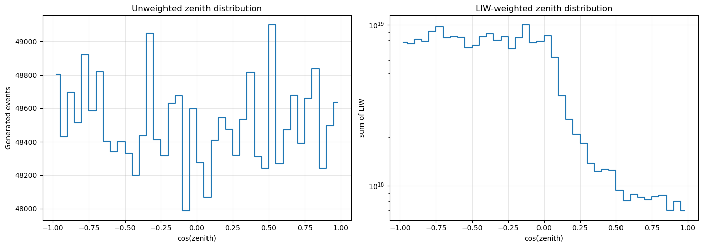
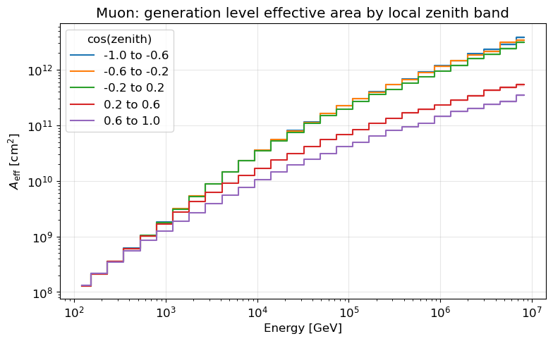
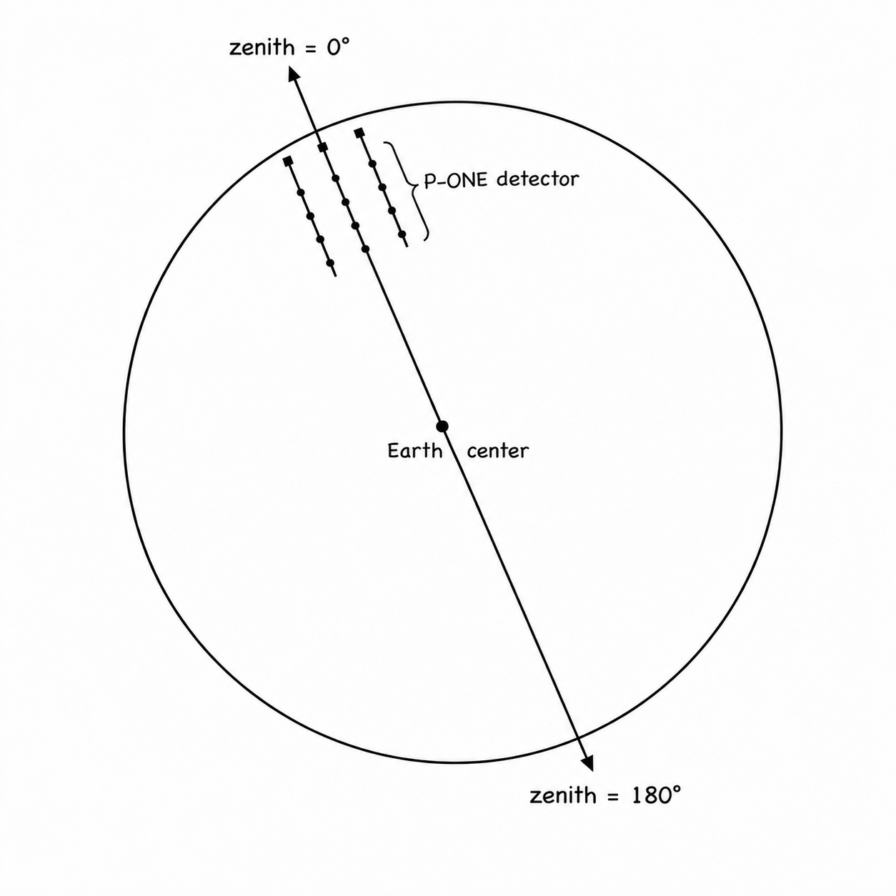
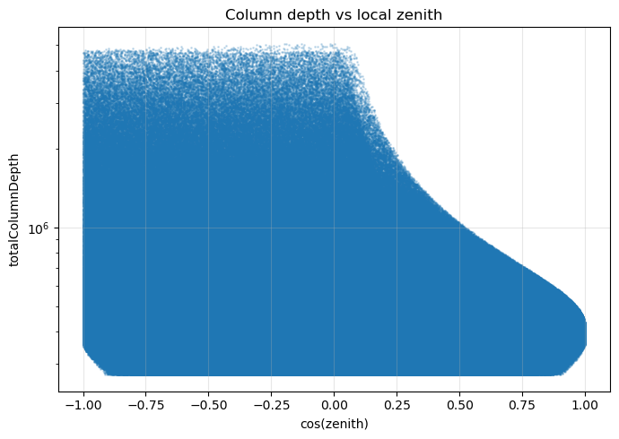

# LeptonInjector Weights (LIW)

## Bad I3 Files

`calculate_LIW.py` checks `Metadata/paths.py` for known problematic input files:

- files listed under `no_daq_for_some_reason` are skipped without adding events
  to the LIW CSV.
- files listed under `available_daq_counts` are processed only up to the recorded
  number of safe DAQ frames.

The per-file result is written to `<logdir>/<Flavor>_file_stats.csv`, including
the applied bad-file rule and DAQ-frame limit.


## Unit of LIW

The following `EventProperties` units have been confirmed:

```text
EventProperties.totalEnergy       GeV
EventProperties.zenith            rad
EventProperties.azimuth           rad
EventProperties.finalStateX       dimensionless
EventProperties.finalStateY       dimensionless
EventProperties.initialType       particle code / enum
EventProperties.finalType1        particle code / enum
EventProperties.finalType2        particle code / enum
EventProperties.totalColumnDepth  g/cm^2
EventProperties.x                 meter
EventProperties.y                 meter
EventProperties.z                 meter
```


## Section 1: My Understanding

This section summarizes my current interpretation of the LIW weights produced
with LeptonWeighter. The interpretation is based on the LeptonWeighter source
code and on the *LeptonWeighter Design and Specifications* document quoted below
in Section 2.

In particular, Section 2 states that the flux used by the weighter as an input is
the neutrino flux **arriving** at the detector. In this analysis, I use a constant
flux. Therefore, I interpret the result as an analysis under a flux that is
constant at the detector, both in energy and in direction. If needed, a physical
atmospheric or astrophysical flux model can also be used instead. My current
question is: for effective-area studies, is using a unit flux model the correct
choice?

A useful way to read the `sum(LIW)` plots is:

```text
sum(LIW) is an expected interaction-contribution distribution, not a flux distribution.
```

A flat arriving flux does not imply a flat interaction distribution. The
interaction contribution can still depend on energy, direction, cross section,
generation geometry, and the event's `totalColumnDepth`.



Figure: The unweighted `cos(zenith)` distribution is approximately flat, as
expected from uniform direction generation. The LIW-weighted distribution is not
a flux histogram; it shows the expected interaction contribution under a unit
neutrino flux arriving at the detector. The plot on the right is surprising to
me, so I want to check carefully whether I am interpreting and calculating LIW
correctly.

As shown in the figure, the expected interaction contribution depends strongly on
zenith. I think this may be related to the total column depth that the neutrino
travels through the Earth. To check this interpretation, I also plotted
`cos(zenith)` versus `totalColumnDepth` below.

Why the zenith dependence of LIW feels confusing to me:

If the flux model used in LeptonWeighter were the flux outside the Earth, rather
than the flux arriving at the P-ONE detector, this zenith dependence would feel
more intuitive. However, according to the LeptonWeighter specification, this is
not the convention: the flux is the neutrino flux arriving at the detector. This
raises the following question for me.

In LeptonInjector, are we not already assuming that the neutrino has passed
through the Earth and arrived near the detector? The LeptonInjector model seems
to generate neutrino interactions in the vicinity of the detector. If that is the
case, why should the amount of column depth traveled affect the final weight? Is
the probability for a neutrino to interact really something that accumulates as
"the more material it crosses, the more likely it is to interact"?

I checked the LeptonWeighter source code. The relevant schematic formula is:

```text
P_interact = 1 - exp(-sigma_total * N_A * X)
```

Here, `X` is the total column depth.

This comes from the LeptonWeighter generator-probability source code:

```cpp
// /usr/local/LeptonWeighter/private/LeptonWeighter/Generator.cpp
return differential_xs / (1. - exp(-total_xs * number_of_targets));

double RangeGenerator::number_of_targets(Event& e) const {
    return Constants::Na * e.total_column_depth;
}

double VolumeGenerator::number_of_targets(Event& e) const {
    return Constants::Na * e.total_column_depth;
}
```

For small interaction probability, this becomes approximately:

```text
P_interact ~= sigma_total * N_A * X
```

According to this formula, LIW clearly depends on `X`. As mentioned above, I do
not yet understand this intuitively. Either I am misunderstanding the overall
logic of LeptonWeighter, or I am only misunderstanding the meaning of this
specific formula and how the column-depth dependence enters the weight.

The second plot is the effective-area plot:



Figure: Muon generation-level effective area as a function of energy, split by
local `cos(zenith)` band. This includes all generated events, not only triggered
or selected events. When I compare effective areas for different layouts, such as
the 70-string baseline or the 102-string ROV-constrained layout, I plan to keep
only the events triggered by each specific layout.

For an energy bin and a local zenith band, the effective area is computed as:

```text
A_eff(E_bin, cosz_band) = sum(LIW_i) / (DeltaE * DeltaOmega)
```

where `LIW_i` is the LeptonInjector weight of event `i`, `DeltaE` is the
energy-bin width, and for a local zenith band `[cosz_min, cosz_max]`:

```text
DeltaOmega = 2 * pi * (cosz_max - cosz_min)
```

### Summary (Please correct me if I am wrong)

1. A possible confusion is to think that summing LIW weights in energy or zenith
   bins gives the physical neutrino flux. This is not correct. The flux is an
   input to the weighting, not an output of summing weights.

2. LIW-weighted histograms are expected interaction-contribution histograms under
   a unit neutrino flux arriving at the detector. Equivalently:

```text
LIW_i = the interaction contribution represented by MC event i under a unit neutrino flux arriving at the detector
```

Therefore, `sum(LIW)` versus energy answers:

```text
If a unit neutrino flux arrived at P-ONE, how much interaction contribution would each energy bin produce?
```

Similarly, `sum(LIW)` versus zenith answers:

```text
If a unit neutrino flux arrived from each direction, how much interaction contribution would each zenith bin produce?
```

### My Plan (Please correct me if this does not make sense)

The goal is to compare different detector layouts. I calculated event weights
using all available events. Ideally, I think the correct pipeline is:

1. Calculate event weights from the available data and store them in a table such
   as:

```text
EventID, LIW
1, 3
2, 8
...
```

2. For a given detector layout, take the subset of events triggered by that
   layout. In other words, select the corresponding events from the table from the first step.
   Then use those selected events and their LIW values to compute the effective
   area using the formula above. Repeat this for each geometry.

3. To understand whether the comparison is statistically meaningful, also compute
   `sigma(A_eff)` for each effective-area curve. Then draw the effective-area
   curves for the compared geometries on the same plot. My current interpretation
   is that if the curves differ by more than the statistical uncertainty bands,
   then the difference in effective area is statistically meaningful.

4. I may also use Maria's figure of merit from MSU as an additional comparison
   metric.

### Some Other Helper Plots



Figure: The zenith convention on the x-axis should be interpreted using the
P-ONE local coordinate convention.



Figure: The event `totalColumnDepth` depends strongly on local zenith. This helps
explain why the LIW-weighted zenith distribution is not flat under a unit
arriving flux.


